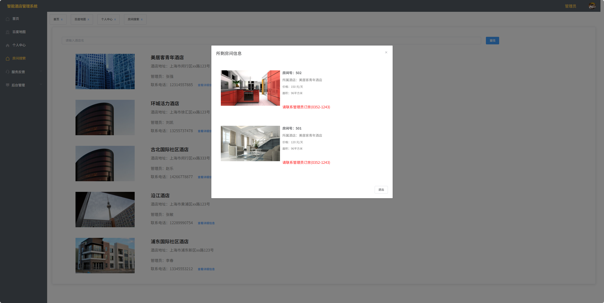

# 智能酒店管理系统(文末免费领取☟)
> 
#### 介绍
智能酒店管理系统(Java_SpringBoot_Vue)
有BUG可留言加微

#### 软件架构
Java + SpringBoot + Vue + Mybatis + Mysql

#### 项目功能说明

> + 首页
> + 百度地图
> + 个人中心
> + 房间搜索
> + 服务反馈：聊天室、在线留言、在线报修
> + 后台管理：财务管理、酒店管理、房间管理、用户管理、权限菜单、员工/用户、签约订单、订单管理
>
> + 角色包含：系统管理员、普通用户、维修员、酒店管理员、已签约会员、未实名游客
> + 角色和权限都由管理员创建修改

### 部分功能演示

### 环境需求(可免费提供)
- idea/eclipse、jdk-1.8、maven-3.8.6、mysql、node.js等

## 有项目修改、安装调试需求 请联系以下

## 获取资源扫☝☝☝

